
# tarea2-peps

## Pascual Barrer Ferrer

## Comandos básicos
---

Para empezar creamos un directorio de trabajo en local para hacer las pruebas e iniciamos git:

A continuación creamos un archivo de texto y ejecutamos `git status` para ver los cambios respecto al registro que lleva git. Nos muestra un mensaje diciendo que el nuevo archivo todavía no se encuentra en seguimiento. Para remediarlo ejecutamos un `add` y hacemos el primer `commit`. Si volvemos a comprobar el estado de git vemos que ahora todos los cambios están actualizados en git.

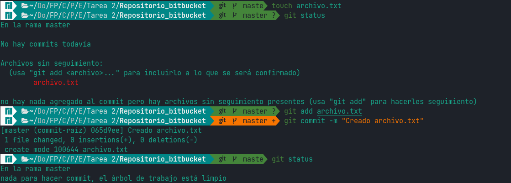

Para ir añadiendo cambios, insertamos una línea al archivo y hacemos un `commit -am` para no tener que hacer el `add` y el `commit` por separado (`-a` viene de `add`):

Dejando ahora de lado la terminal, vamos a la página oficial de Bitbucket y nos creamos una cuenta. Para facilitar las cosas, utilizamos una cuenta de Google:

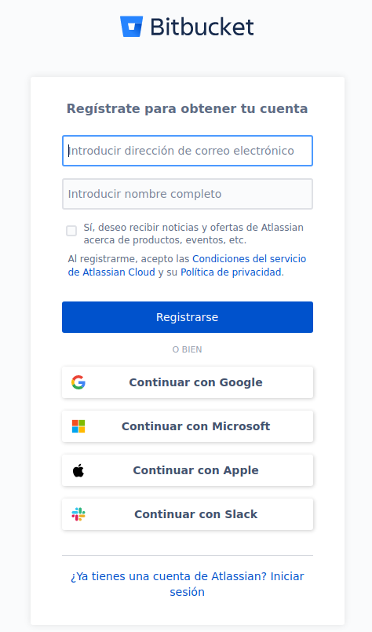

Al finalizar el proceso de alta de la cuenta nos aparece la siguiente pantalla. Aquí clicamos sobre crear repositorio.

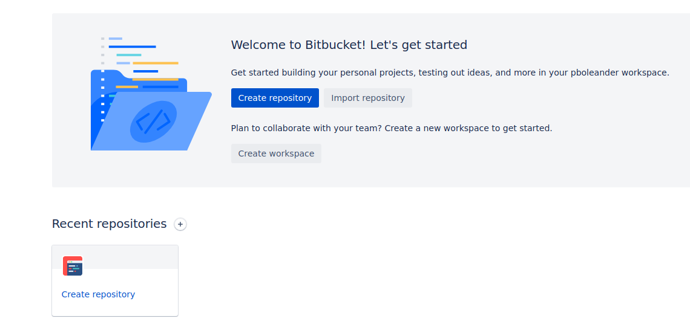

Lo que nos lleva a la siguiente pantalla. Seleccionamos una serie de opciones a nuestro gusto y clicamos en crear repositorio.

Una vez creado el repositorio nos aparece una nueva pantalla (similar a las que aparecen en GitHub y GitLab) con todos los comandos que podemos usar para sincronizar nuestro nuevo repositorio remoto con el que tenemos ya creado en local.

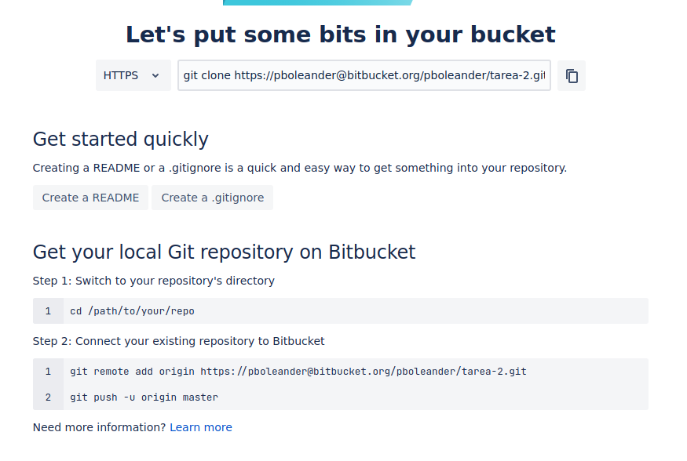

Antes de ponernos manos a la obra con los comandos necesitamos hacer un paso previo: dar de alta una contraseña para acceder a los repositorios que creemos en Bitbucket. Para ello nos dirigimos a la esquina inferior izquierda de la pantalla y hacemos clic en el icono con nuestro avatar (o iniciales si no hemos elegido uno) y seleccionamos Personal settings.

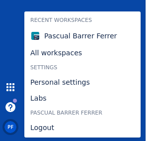

En la nueva pantalla que aparece, clicamos sobre App passwords en la barra lateral y le damos a Create app password. Rellenamos una serie de detalles como la etiqueta (podemos poner lo que queramos) y seleccionamos permisos de lectura y escritura en los repositorios. Copiamos la contraseña que nos aparece y ya tendremos lo necesario para acceder a Bitbucket desde la terminal.

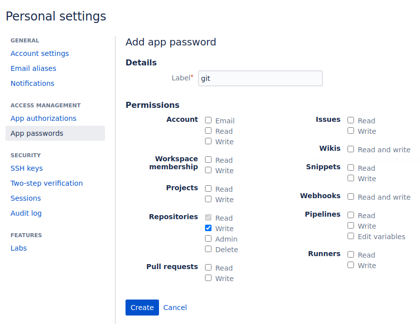

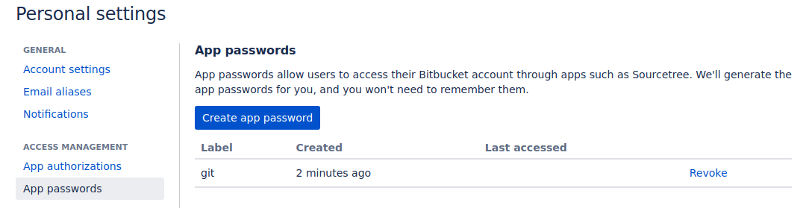

Volvemos a la terminal y añadimos el `origin` con el comando que copiamos de la pantalla de bienvenida al nuevo repositorio. Hacemos `push` e introducimos la contraseña que hemos copiado en el paso anterior.

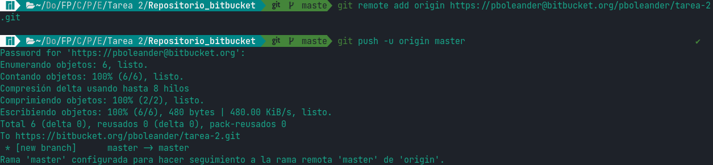

Si comprobamos que el `push` ha ido bien recargando la página donde tenemos el repositorio remoto vemos que, efectivamente, nuestros cambios se ven reflejados:

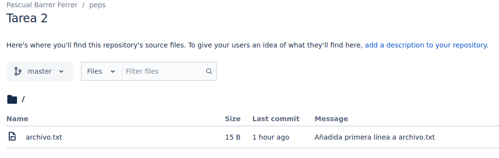

Añadamos otra línea a nuestro archivo para poder ver como revertir un cambio en git. Si después del cambio no hemos hecho un `add` podemos usar los comandos de la siguiente imagen. Cuando miramos el contenido del archivo vemos que se ha recuperado la versión que tenía guardada git antes del cambio.

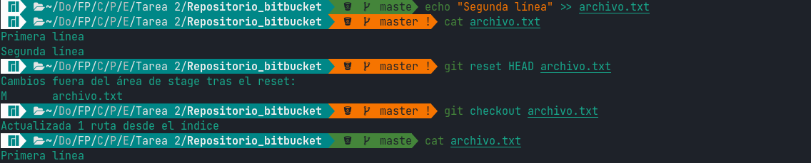

Ahora vamos a añadir más cambios: recuperamos la segunda línea y añadimos una tercera. Por cada línea hacemos un `commit -a` para que git tenga constancia de todo este historial de versiones:

Ahora que hemos hecho diversos `commit`, si queremos volver a una versión X podremos hacerlo mediante un `checkout`. Si al escribir `git checkout` pulsamos tabulación la consola nos ofrecerá todo el historial de versiones disponible para que nosotros podamos elegir fácilmente a qué versión queremos regresar.

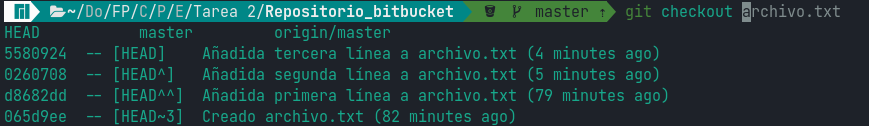

Elegimos una, por ejemplo, la segunda en la que habíamos añadido sólo la primera línea (identificada por el hash d8682dd), luego miramos el archivo y veremos que, efectivamente, hemos recuperado la versión deseada.

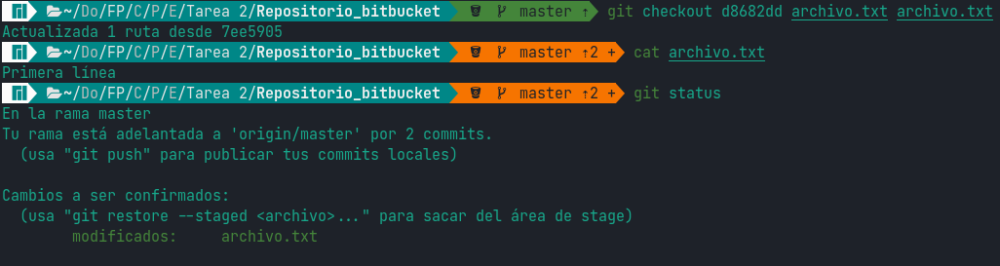

Que estemos en esta versión ahora no significa que las demás (las posteriores a la actual) hayan desaparecido. Si repetimos la operación de escribir `git checkout` y pulsar tabulación vemos que siguen estando todos los `commit` que hemos hecho.

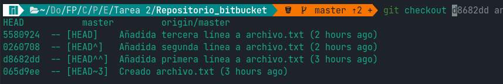

Recuperemos todos los cambios, es decir, volvamos al HEAD, y hagamos `push` para tenerlo todo guardado en remoto.

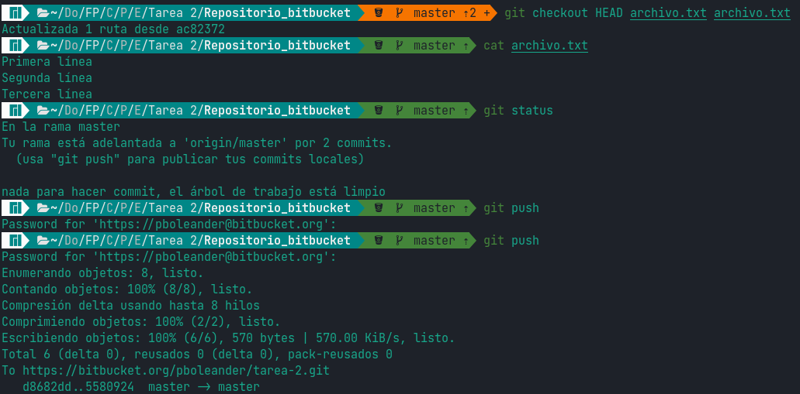

Después de hacerlo, hacemos un cambio en remoto para ver cómo funciona el `pull`.

Antes del cambio

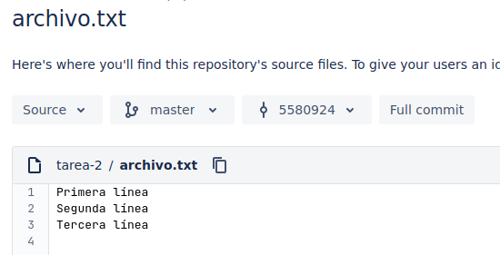

Después del cambio

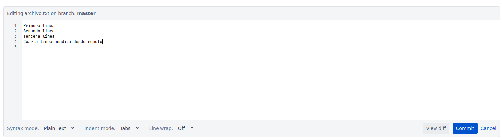

Pulsamos en el botón azul (Commit) para guardar los cambios. Vamos a una terminal y hacemos `pull`.

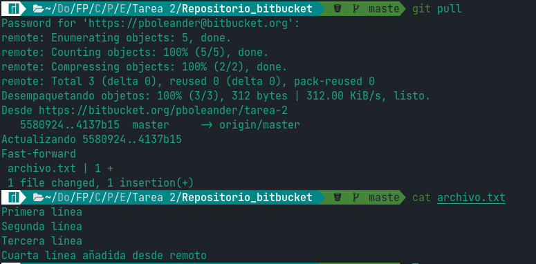

Como podemos observar los cambios hechos en remoto se han descargado correctamente a nuestra copia local.
